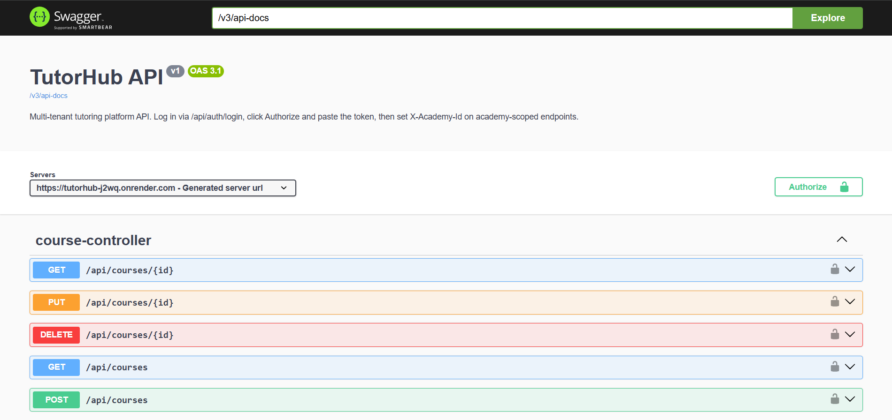

# TutorHub

A multi-tenant REST API for tutoring academies. Each academy manages its own staff, students, courses, assignments, and grading — fully isolated from every other academy on the same instance.

[](https://github.com/chaitanya-020/tutorhub/actions/workflows/ci.yml)

- **Live API:** https://tutorhub-j2wq.onrender.com
- **Interactive docs (Swagger UI):** https://tutorhub-j2wq.onrender.com/swagger-ui.html
- **Health check:** https://tutorhub-j2wq.onrender.com/actuator/health

> Hosted on Render's free tier — the service sleeps after ~15 min of inactivity, so the first request after an idle period takes ~30s to wake.

---

## Highlights

- **Two-layer access control**, both proven by integration tests:
  - **Cross-tenant isolation** — Academy A and Academy B cannot see each other's data; requesting another tenant's resource returns `404` (doesn't even leak existence).
  - **Per-student scoping** — within an academy, a `STUDENT` sees only the courses they're enrolled in and only their own submissions.
- **JWT authentication** with `BCrypt`-hashed passwords; stateless, per-request.
- **Per-academy RBAC** — five roles (`DIRECTOR`, `COORDINATOR`, `TUTOR`, `ASSISTANT`, `STUDENT`). Authorities are computed per request from the active academy header, so the same user can be a `DIRECTOR` in one academy and a `STUDENT` in another.
- **Optimistic locking on grading** — concurrent grade attempts on a stale version return `409 Conflict` instead of silently overwriting.
- **Scheduled email reminders** — a cron job runs hourly, finds assignments due in the next 24 hours, and emails each enrolled student asynchronously.
- **OpenAPI / Swagger UI** — every endpoint documented, with JWT auth and the academy header wired into the "Try it out" console.
- **Tested with Testcontainers** — integration tests run against a real PostgreSQL launched in Docker, so the access model is verified end-to-end.
- **CI/CD** — GitHub Actions runs the full test suite on every push; deployed to Render via Docker.

---

## Stack

Java 21 · Spring Boot 3.5 · Spring Security · Spring Data JPA / Hibernate · PostgreSQL 17 · Flyway · JWT (jjwt) · springdoc-openapi · JUnit 5 · Mockito · Testcontainers · Docker · GitHub Actions · Render

---

## Swagger UI



The full API is browsable and executable at [`/swagger-ui.html`](https://tutorhub-j2wq.onrender.com/swagger-ui.html). Log in via `POST /api/auth/login`, click **Authorize**, paste the token, and set `X-Academy-Id` on academy-scoped endpoints to exercise them live.

---

## Architecture

```
┌──────────────────────────────────────────────────────────────────┐
│  Client                                                          │
└──────────┬───────────────────────────────────────────────────────┘
           │  Authorization: Bearer <jwt>
           │  X-Academy-Id: <academy_id>
           ▼
┌──────────────────────────────────────────────────────────────────┐
│  Spring Security filter chain                                    │
│    1. JwtAuthenticationFilter — validates JWT, loads user        │
│    2. TenantFilter — resolves active academy from header,        │
│       loads the user's Membership, sets TenantContext, adds      │
│       ROLE_<role> authority for THIS academy                     │
└──────────┬───────────────────────────────────────────────────────┘
           ▼
┌──────────────────────────────────────────────────────────────────┐
│  Controllers → @PreAuthorize gates → Services                    │
│    Services enforce:                                             │
│      - cross-tenant isolation (404 on foreign academy)           │
│      - per-student scoping (STUDENT sees only own data)          │
│      - optimistic locking on grading                             │
└──────────┬───────────────────────────────────────────────────────┘
           ▼
┌──────────────────────────────────────────────────────────────────┐
│  PostgreSQL 17  (schema owned by Flyway, validated by JPA)       │
└──────────────────────────────────────────────────────────────────┘
```

**Multi-tenancy model:** shared schema with an `academy_id` discriminator on the tenant-root tables. The `TenantFilter` resolves the active academy on every request from the `X-Academy-Id` header against the user's `Membership`; nested resources derive their academy through the parent chain.

---

## API endpoints

| Group       | Method | Path |
|-------------|--------|------|
| Auth        | POST   | `/api/auth/register` |
| Auth        | POST   | `/api/auth/login` |
| Auth        | GET    | `/api/auth/me` |
| Academies   | GET    | `/api/academies` |
| Academies   | POST   | `/api/academies` |
| Academies   | GET / PUT / DELETE | `/api/academies/{id}` |
| Members     | GET    | `/api/members` |
| Members     | POST   | `/api/members` |
| Courses     | GET    | `/api/courses` |
| Courses     | POST   | `/api/courses` |
| Courses     | GET / PUT / DELETE | `/api/courses/{id}` |
| Enrollments | GET    | `/api/courses/{courseId}/enrollments` |
| Enrollments | POST   | `/api/courses/{courseId}/enrollments` |
| Enrollments | DELETE | `/api/courses/{courseId}/enrollments/{enrollmentId}` |
| Assignments | GET    | `/api/courses/{courseId}/assignments` |
| Assignments | POST   | `/api/courses/{courseId}/assignments` |
| Assignments | GET / PUT / DELETE | `/api/courses/{courseId}/assignments/{assignmentId}` |
| Submissions | GET    | `/api/assignments/{assignmentId}/submissions` |
| Submissions | POST   | `/api/assignments/{assignmentId}/submissions` |
| Submissions | GET    | `/api/assignments/{assignmentId}/submissions/{submissionId}` |
| Submissions | POST   | `/api/assignments/{assignmentId}/submissions/{submissionId}/grade` |

Full schemas and a live "Try it out" console are at [`/swagger-ui.html`](https://tutorhub-j2wq.onrender.com/swagger-ui.html).

---

## Running locally

Requires Java 21, Docker, and Maven (or use the included `mvnw`).

```bash
# 1. Start Postgres
docker compose up -d

# 2. Run the app
./mvnw spring-boot:run

# 3. Open the docs
#    http://localhost:8080/swagger-ui.html
```

### Environment variables

| Variable          | Default                                       | Purpose                         |
|-------------------|-----------------------------------------------|---------------------------------|
| `DB_URL`          | `jdbc:postgresql://localhost:5432/tutorhub`   | Database URL                    |
| `DB_USERNAME`     | `tutorhub`                                    | DB user                         |
| `DB_PASSWORD`     | `secret`                                      | DB password                     |
| `JWT_SECRET`      | _(none — set in your environment)_            | HMAC secret, >= 32 chars        |
| `MAIL_HOST`       | `sandbox.smtp.mailtrap.io`                    | SMTP host (Mailtrap for dev)    |
| `MAIL_PORT`       | `2525`                                        | SMTP port                       |
| `MAIL_USERNAME`   | _(empty)_                                     | SMTP username                   |
| `MAIL_PASSWORD`   | _(empty)_                                     | SMTP password                   |
| `MAIL_FROM`       | `noreply@tutorhub.local`                      | From address on reminder emails |
| `REMINDERS_CRON`  | `0 0 * * * *`                                 | When the reminder job runs      |

### Tests

```bash
./mvnw verify
```

Runs the full suite, including the Testcontainers integration test that boots a real PostgreSQL and asserts cross-tenant isolation, per-student scoping, and the optimistic-lock `409`.

---

## Scheduled reminders

A `@Scheduled` job scans hourly for assignments due within the next 24 hours and emails each enrolled student via an `@Async` `JavaMailSender`. A `reminder_sent_at` timestamp on each assignment prevents duplicate emails. In development, emails are captured by a Mailtrap sandbox inbox.

<!-- After capturing the Mailtrap screenshot, save it as docs/mailtrap.png and uncomment:

-->

---

## Author

Sai Chaitanya Gelivi
